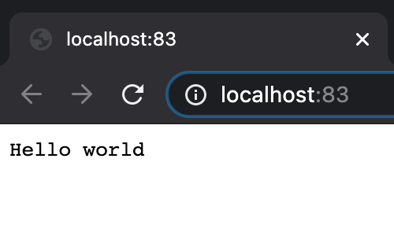
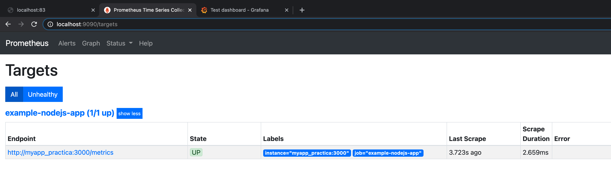
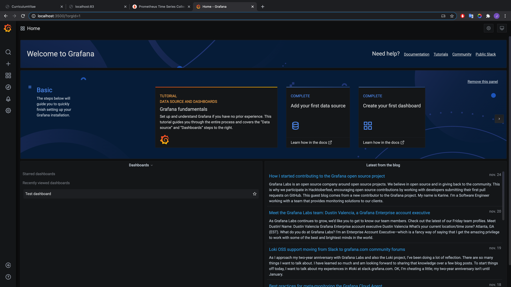
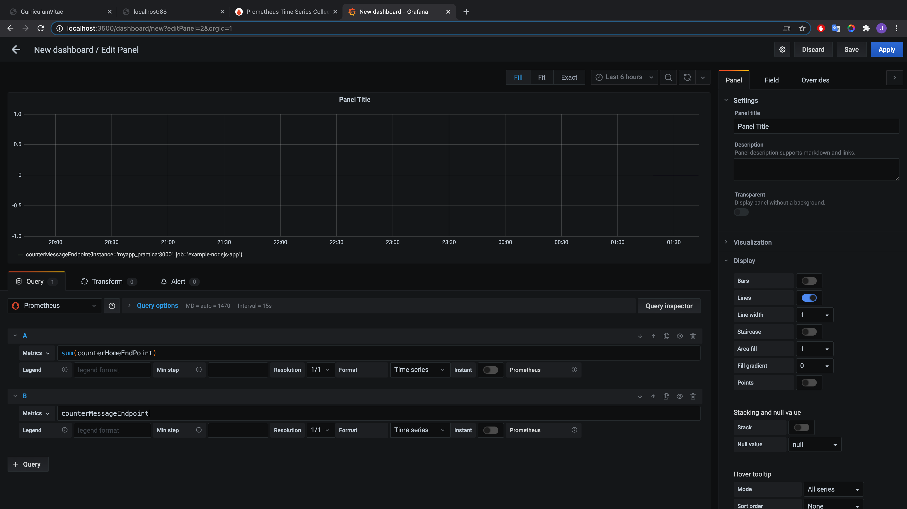
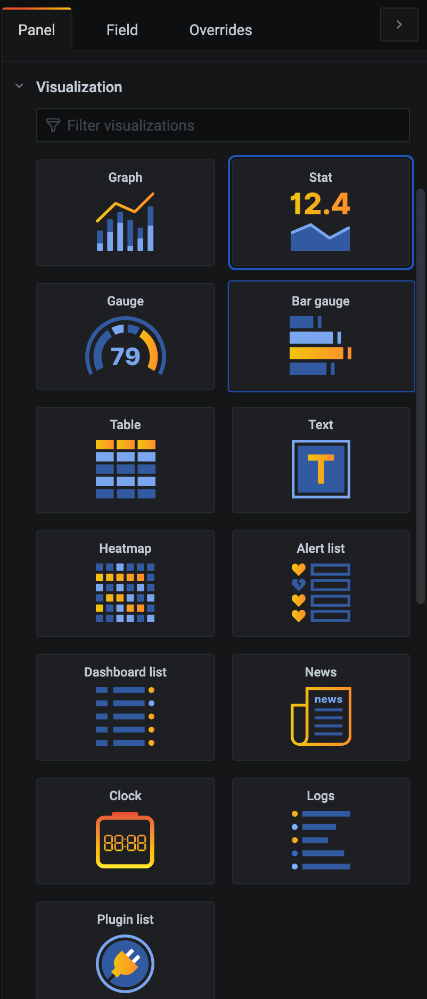
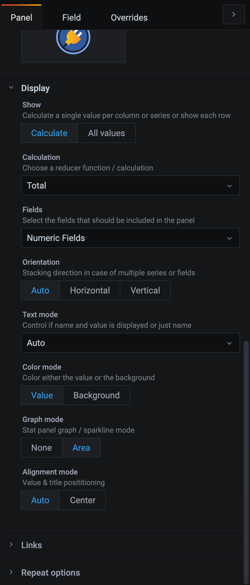
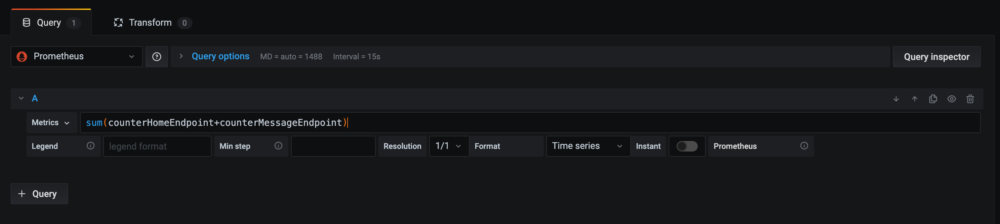

# Práctica Node, Prometheus y Grafana (docker-compose) 

Práctica de Despliegue de Aplicaciones Web realizada por Jairo Julià Bravo, en la que por mediante de docker-compose debemos crear un sistema compuesto por los servicios de node, prometheus y grafana.


## Prometheus
---

Prometheus es una aplicación de software gratuita que se utiliza para registar métricas en tiempo real con una alta dimensionalidad utilizando una base de datos de seires de tiempo construida usando un modelo de extracción HTTP con querys flexibles y en tiempo real. Prometheus tiene una fácil implementación con Grafana.


## Grafana
---

Grafana se ha convertido en la tecnología más popular del mundo utilizada para componer tableros de observación con todo, desde la métrica de Prometeo y Grafito, hasta los registros y datos de aplicaciones de las centrales eléctricas y las colmenas.


## Práctica
---
La práctica consitste en crear un sistema compuesto por los sistemas Node, Prometheus y Grafana descritos anteriormente, de manera que podamos recoger datos, almacenarlos y visualizarlos de una manera mucho más gráfica con la finalidad de aprender nuevas tecnologias y afianzar conocimintos de Docker-compose.

## App

La primera parte de la práctica consiste en crear un contenedor llamado myapp_practica mediante un Dockerfile y este contenedor se trata de un servidor express básico.

### Dokerfile

```
FROM node:alpine3.10
WORKDIR /myapp
COPY ./src ./ 
EXPOSE 3000
RUN npm install 
CMD ["node","app.js"]
```

A partir de una aimgen de node (alpine 3.10) crearemos una imagen con una carpeta llamada "myapp" y copiaremos el contenido de nuestro ./src a este directorio, todo esto apuntando al puerto 3000 de nuestro contenedor. Por último ejecutaremos el comando **npm install** que creara la carpeta node_modules y utilizaremos el comando **node app.js** para arrancar el servidor.

A continuación crearemos el contenedor utilizando el Dockerfile descrito anteriormente, para ello en el fichero `docker-compose.yaml` tendremos el siguiente código: 

```
version: "2"
networks:
  network_practica:
services:   
  app:
    build: .
    container_name: myapp_practica
    ports:
      - "83:3000"
    networks: 
      - network_practica  
```

En este fragmento de código creamos el contenedor apartir del Dockerfile, utilizando el mismo contexto (`build: .`) con el nombre **myapp_practica**, utilizando el puerto 82 de nuestra máquina y el 3000 del contenedor. Todo ello irá enlacada a una misma red que compartirán todos los contenedores llamada `network_practica`

## Prometheus

Ester servicio lo crearemos de forma diferente a el de la aplicación ya que este partira de una imagen de dockerHub y lo incluiremos directamente en el fichero `docker-compose.yaml`.

```
version: "2"
networks:
  network_practica:
services:   
  app:
    build: .
    container_name: myapp_practica
    ports:
      - "83:3000"
    networks:
      - network_practica
prometheus:
    image: prom/prometheus:v2.20.1
    container_name: prometheus_practica
    depends_on:
        - app
    volumes:
    - ./prometheus/prometheus.yml:/etc/prometheus/prometheus.yml
    command: --config.file=/etc/prometheus/prometheus.yml  
    ports:
        - "9090:9090"
    networks: 
        - network_practica       
```

Podemos observar que este contenedor se creará apartir de una versión específica de promehteus para así evitar incompatibilidades entre versiones, con el nombre `prometheus_practica`, el cual va a depender de el contenedor anterior `app`. Para este contenedor debemos crear un volumen para poder copiar el fichero `prometheus.yml ` que configura este servicio. Como hemos dicho antes todos los contenedores compartirán la misma network y en este caso escucharemos a el puero `9090` tanto en nuestra máquina como en el contenedor.

## Grafana

Este contenedor es similar al de prometheus ya que partiremos de una imagen de docker hub en vez de un Dockerfile, para ello modificaremos el fichero `docker-compose.yaml`

```
version: "2"
networks:
  network_practica: 
volumes:
  prometheus.yml:
  myGrafanaVol:
  datasources.yml:
services:   
  app:
    build: .
    container_name: myapp_practica
    ports:
      - "83:3000"
    networks: 
      - network_practica
  prometheus:
    image: prom/prometheus:v2.20.1
    container_name: prometheus_practica
    depends_on:
      - "app"
    volumes:
      - ./prometheus/prometheus.yml:/etc/prometheus/prometheus.yml
    command: --config.file=/etc/prometheus/prometheus.yml  
    ports:
      - "9090:9090"
    networks: 
     - network_practica 
  grafana:
    image: grafana/grafana:7.1.5
    container_name: grafana_practica
    depends_on:
      - prometheus
    volumes:
      - myGrafanaVol:/var/lib/grafana
      - ./grafana/datasources.yml:/etc/grafana/provisioning/datasources/datasources.yml
    ports:
      - "3500:3000"
    environment:
      - GF_AUTH_DISABLE_LOGIN_FORM=true
      - GF_AUTH_ANONYMOUS_ENABLED=true
      - GF_AUTH_ANONYMOUS_ORG_ROLE=Admin
      - GF_INSTALL_PLUGINS=grafana-clock-panel 1.0.1
    networks: 
     - network_practica  
```

En este contenedor partimos desde la imagen de grafana `7.1.5` para evitar incompatibilidades, como todos los contenedores le atribuiremos un nombre, en este caso `grafana_practica` y este dependerá de **prometheus**. Para este conenedor crearemos un volumen llamado `myGrafanaVol` para poder copiar el fichero `datasource.yml` que contiene los parámetros de configuración para poder connectarse a prometheus, lo enlazaremos a el puerto 3500 de nuestra máquina y al 3000 del servidor y compartiran la misma red `network_practica`.
En útlimo lugar he decidido explicar las variables de entorno, ya que han sido el mayor dolor de cabeza de grafana ya que el orden en que se lo colocaban tiene que diferentes resultados y a nosotoros nos interesa desactivar el inicio de sesión, tener total libertad y utilizar grafana sin haber iniciado sesión.

`GF_AUTH_DISABLE_LOGIN_FORM=true`  (Desactivamos el inicio de sesión)
`GF_AUTH_ANONYMOUS_ENABLED=true`  (No necesitamos haber iniciado sesión para utilizar grafana)
`GF_AUTH_ANONYMOUS_ORG_ROLE=Admin`  (Accedemos de forma Anónima y con el rol de Admin)
`GF_INSTALL_PLUGINS=grafana-clock-panel 1.0.1`  (Instalamos el plugin del reloj)

## .dockerignore
Como en todos los proyectos que instalen node entre ellos, debemos crear un dockerignore par aque la carpeta `node_modules` no se guarde poe lo que el contenido de nuestro fichero será el siguiente:

```
**/node_modules
```

## Ejecución
---
Para poner en e marcha nuestros contenedores lo haremos ejecutando el comando `docker-compose up` en la terminal, desde el directorio raiz.

Una vez realizado este comando podemos acceder al pueto 83 localhost y veremos el index.html de nuestra servidor express



Si accedemos a el puerto 9090 podemos observar que Prometheus esta funcionado y si nos vamos a el apartado **Targets** podemos cobrobar que esta connectado a nuestro servidor.



Si accedemos a localhost:3500 podremos observar que Grafana estará funcionando y podremos entrar sin iniciar sesión y en modo administrador.



Cuando accedamos a Grafana podemos crear un nuevo **Dashboard** y añadir **Panels** donde mostrar la información y para mostar información en el panel debemos introducir las siguientes Querys según las métricas del servidor de Prometheus



Posteriormente añadiremos un panel pero este de forma númerica. Para ello en la columna de la derecha accionaremos el boton de Stat en el apartado de **Visualización** 



y en el apratado de **Display** mostratremos el valor total.



La query que debemos utilizar para poder mostrar la suma de los contadores es la siguiente:



Como resultado final podemos observar que se visualizan los dos **Panels** en nuestro **Dashboard** utilizando los endpoints de **Prometheus**.


